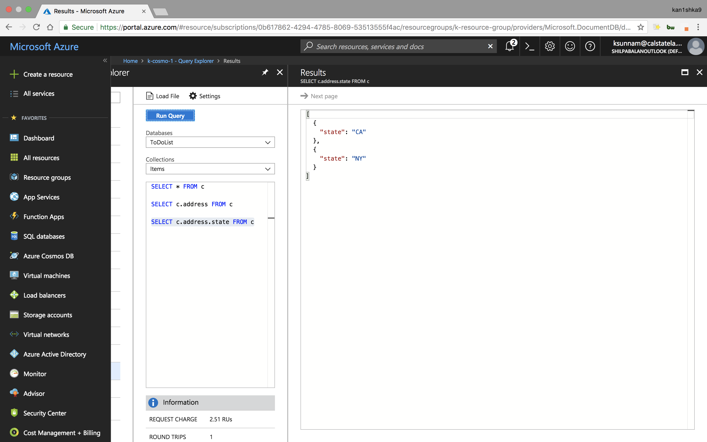

#### Azure Cosmos DB


``ABC.json``

```json
{
  "id": "ABCFamily",
  "lastname": "ABC",
  "children": {
    "firstname": "Anna",
    "grade": "10"
  },
  "grandchildren": {
    "firstname": "Mary",
    "grade": "9"
  },
  "address": {
    "country": "USA",
    "state": "CA",
    "city": "LA"
  },
  "favourite fruits": {
    "first_fav": "Mango",
    "second_fav": "Watermelon",
    "third_fav": "Grapes",
    "fourth_fav": "Apples"
  }
}
```

``XYZ.json``

```json
{
  "id": "XYZFamily",
  "children": [
    {
      "lastname": "Anna",
      "givenname": "James",
      "grade": 8
    },
    {
      "lastname": "Mary",
      "givenname": "Thyme",
      "grade": 3
    }
  ],
  "address": {
    "country": "USA",
    "state": "NY",
    "city": "Manhattan"
  }
}
```


[``SQL queries for Azure Cosmos DB``](https://docs.microsoft.com/en-us/azure/cosmos-db/sql-api-sql-query)

```sql
SELECT * FROM c

SELECT c.address FROM c

SELECT c.address.state FROM c

SELECT c.grandchildren FROM c

SELECT c.children FROM c

SELECT c.address.state FROM c where c.address.state="NY"

SELECT * FROM ch IN c.children

SELECT ch.givenname ?? ch.firstname AS childname, ch.grade FROM ch IN c.children

SELECT VALUE c.lastname || ',' || c.address.state FROM c

select * from Items

select * from c.children

select c.children from c where c.address.state = 'NY'

select f.id, f.location.city, f.location.state, ch.givenName ?? ch.firstName as childName from c as f join ch in f.children

select { "child": ch.givenName ?? ch.firstName, "grade": ch.grade } as childAndGrade from ch in c.children

select [ ch.givenName ?? ch.firstName, ch.grade ] as childAndGrade from ch in c.children

select value [ ch.givenName ?? ch.firstName, ch.grade ] from ch in c.children
```





